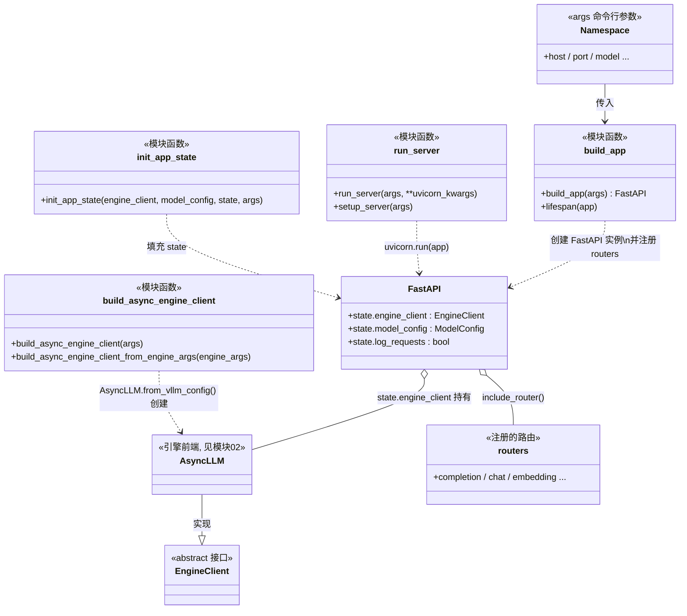

# 01 · API Server（FastAPI 入口）类图

> 源码：`vllm/entrypoints/openai/api_server.py`
> 说明：这一层**没有 OOP 继承关系**，本质是一组模块级函数 + FastAPI 框架对象，
> 所以这张图更像"组件图"，画的是**谁创建谁、谁持有谁**。

## 关键点

1. **`build_app(args)`**：纯粹的"搭框架"——`FastAPI(lifespan=lifespan)`，
   然后把 completion / chat / embedding 等一堆 router `include_router()` 挂上去。
   - `build_app` 里只做**路由注册**，不碰模型。
2. **`lifespan` 上下文**：FastAPI 启动时先进 `lifespan`，在 `yield` 之前调
   `init_app_state()`，用 `build_async_engine_client()` 真正把 `AsyncLLM` 造出来，
   塞进 `app.state.engine_client`，供所有 handler 使用。
3. **`build_async_engine_client`**：`AsyncEngineArgs.from_cli_args(args)` →
   `create_engine_config()` → `AsyncLLM.from_vllm_config()`。这里才是"引擎前端"的出生点。
4. **`run_server`**：最终 `uvicorn.run(...)`，把 `build_app` 造出来的 app 跑起来。
