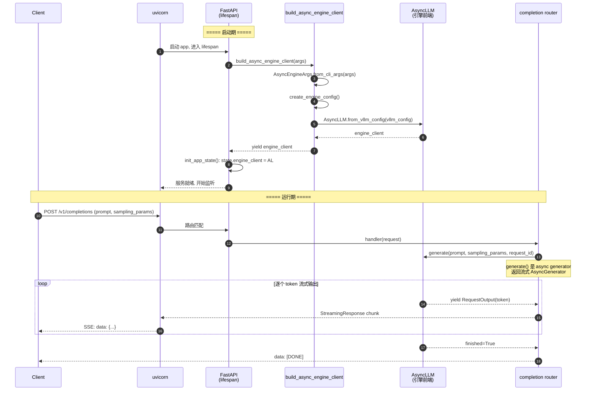

# 01 · API Server 时序图

> 一条 `/v1/completions` 请求从进来到流式返回的全过程。
> 前半段是**启动期**（lifespan 建引擎），后半段是**运行期**（单条请求）。

```mermaid
sequenceDiagram
    autonumber
    participant C as Client
    participant UV as uvicorn
    participant App as FastAPI<br/>(lifespan)
    participant B as build_async_engine_client
    participant AL as AsyncLLM<br/>(引擎前端)
    participant R as completion router

    Note over App: ===== 启动期 =====
    UV->>App: 启动 app, 进入 lifespan
    App->>B: build_async_engine_client(args)
    B->>B: AsyncEngineArgs.from_cli_args(args)
    B->>B: create_engine_config()
    B->>AL: AsyncLLM.from_vllm_config(vllm_config)
    AL-->>B: engine_client
    B-->>App: yield engine_client
    App->>App: init_app_state(): state.engine_client = AL
    App-->>UV: 服务就绪, 开始监听

    Note over C,R: ===== 运行期 =====
    C->>UV: POST /v1/completions (prompt, sampling_params)
    UV->>App: 路由匹配
    App->>R: handler(request)
    R->>AL: generate(prompt, sampling_params, request_id)
    Note over R: generate() 是 async generator<br/>返回流式 AsyncGenerator
    loop 逐个 token 流式输出
        AL-->>R: yield RequestOutput(token)
        R-->>UV: StreamingResponse chunk
        UV-->>C: SSE: data: {...}
    end
    AL-->>R: finished=True
    R-->>C: data: [DONE]
```
