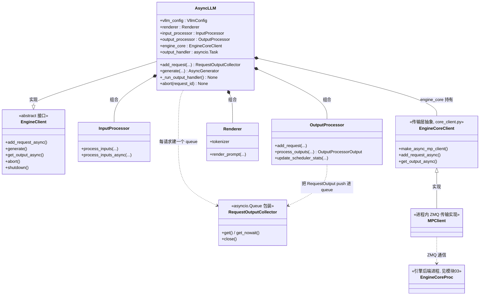

# 02 · AsyncLLM（引擎前端）类图

> 源码：`vllm/v1/engine/async_llm.py`、`core_client.py`、`input_processor.py`、`output_processor.py`
> 角色：**引擎前端** = 输入预处理 + 输出后处理 + 与引擎后端(EngineCore)通信的**传输层**。

## 关键点

1. **三段式分工**：`InputProcessor` 把 prompt 变成 `EngineCoreRequest`；
   `OutputProcessor` 把 `EngineCoreOutputs` 变回 `RequestOutput`；
   中间的 `engine_core`（`EngineCoreClient`）只负责**跨进程搬运**。
2. **`engine_core` 是传输层**：`EngineCoreClient.make_async_mp_client()` 造的 `MPClient`，
   用 ZMQ 跟后端的 `EngineCoreProc` 通信（见模块 03）。
3. **`output_handler` 是后台协程**：`_run_output_handler()` 里 `asyncio.create_task()` 一个
   while 循环，持续 `engine_core.get_output_async()` 拉结果 → `process_outputs()` →
   把每个 `RequestOutput` push 到对应请求的 `RequestOutputCollector`。
4. **`generate()` 是 async generator**：调用方 `async for` 迭代它，逐个 token yield 出去。
   它自己不拉结果，只是从 `RequestOutputCollector` 里 `get()`。
