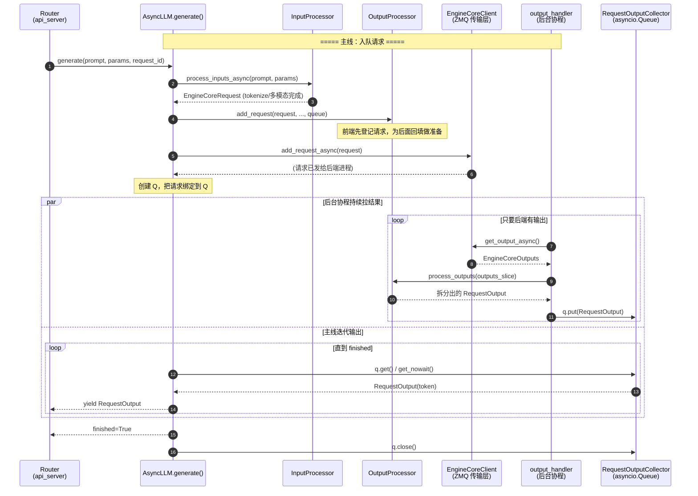

# 02 · AsyncLLM 时序图

> 一条请求的两条并行线：**主线** `generate()` 负责入队，**后台线** `output_handler` 负责拉结果回填。
> 两条线通过 `RequestOutputCollector`（asyncio.Queue）解耦。

## 关键点

1. **入队与出队分离**：`generate()` 只负责把请求 `add_request` 进去，然后开始 `await q.get()`；
   真正拉后端结果的是后台 `output_handler` 协程，两者靠 `RequestOutputCollector` 解耦。
2. **`n > 1` 采样会 fan-out**：`add_request()` 里若 `params.n > 1`，会构造 `ParentRequest`，
   把请求复制成 n 个 child request 分别入队，最后再由 OutputProcessor 合并。
3. **断连即中止**：`generate()` 被 `CancelledError`（客户端断连）时，会 `await self.abort()` 中止该请求。
4. **分片处理防阻塞**：`output_handler` 用 `VLLM_V1_OUTPUT_PROC_CHUNK_SIZE` 把一大包输出切成小片
   处理，片间 `await asyncio.sleep(0)` 让出事件循环。
