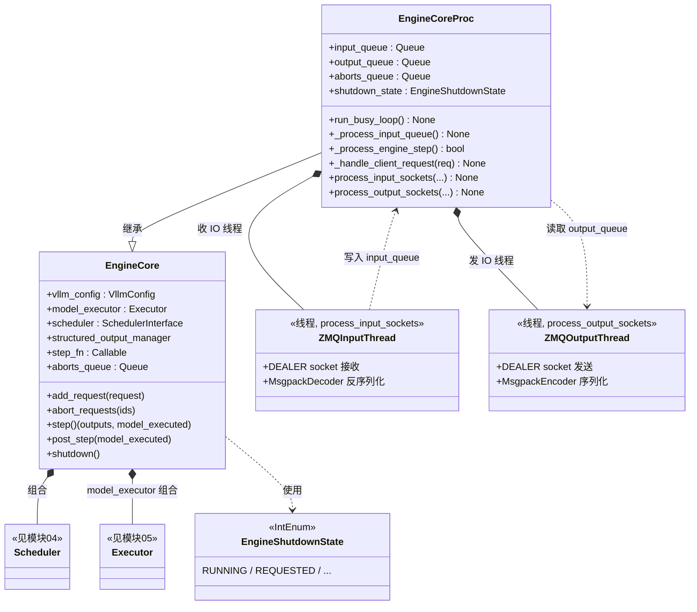

# 03 · EngineCore（引擎后端）类图

> 源码：`vllm/v1/engine/core.py`
> 角色：**引擎后端**。`EngineCore` 是纯计算核心（调度 + 执行）；
> `EngineCoreProc` 给它套上"进程 + ZMQ 收发线程 + busy loop"的外壳。

## 关键点

1. **两层设计**：
   - `EngineCore`（纯逻辑）：`step()` = `scheduler.schedule()` → `executor.execute_model()` →
     `scheduler.update_from_output()`，不关心进程和网络。
   - `EngineCoreProc`（外壳）：`run_busy_loop()` 无限循环，两个 ZMQ IO 线程负责
     收前端请求 / 发结果，把消息塞进 `input_queue` / `output_queue`。
2. **`step_fn` 可替换**：单卡走 `self.step`；`max_concurrent_batches > 1`（PP 流水线）
   时换成 `step_with_batch_queue`。见 `core.py:285`。
3. **ZMQ 收线程（`process_input_sockets`）**：用 `zmq.DEALER` + `zmq.Poller`，
   收到 `(RequestType, RequestData)` 两帧，`MsgpackDecoder` 反序列化后 `input_queue.put_nowait()`。
4. **abort 双队列**：ABORT 请求同时进 `aborts_queue` 和 `input_queue`，既能急切处理，又保证顺序。
