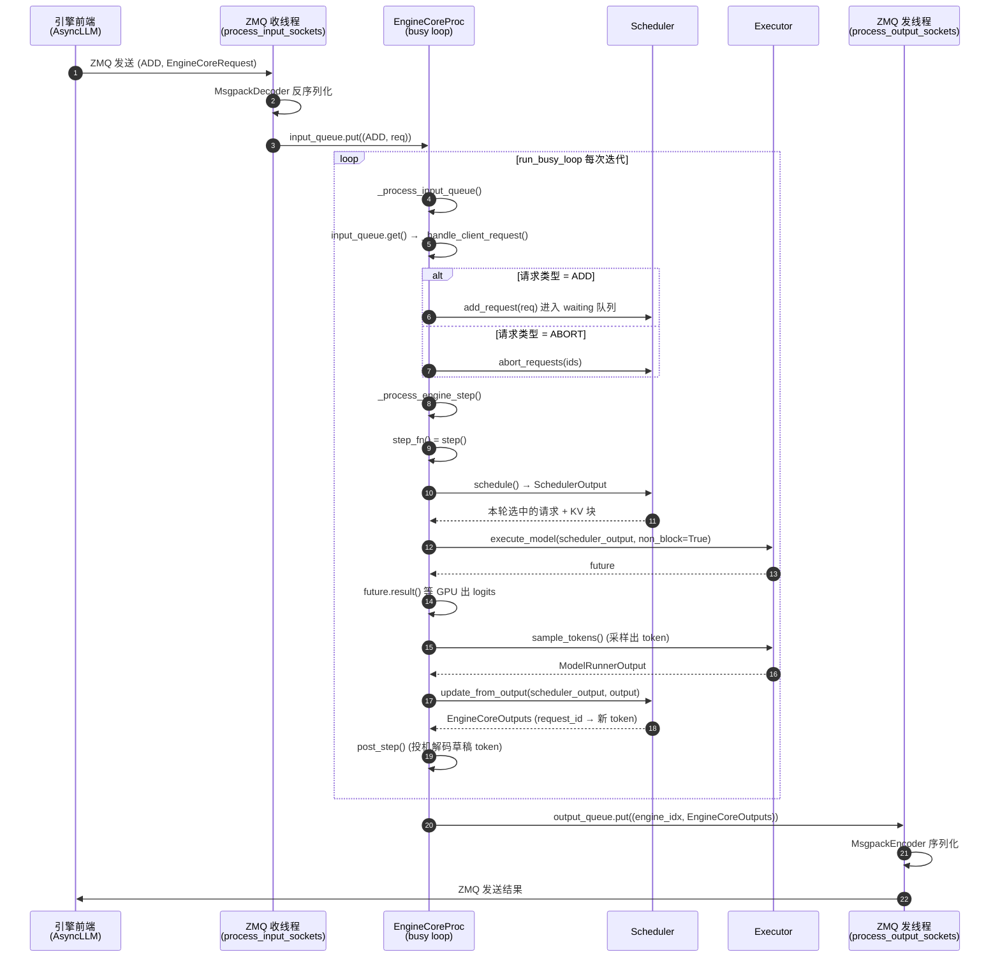

# 03 · EngineCore 时序图

> **EngineCoreProc 的 busy loop 一个完整迭代**：收请求 → 调度 → 执行 → 回传结果。

## 关键点

1. **busy loop 三步**：`_process_input_queue()`（收请求）→ `_process_engine_step()`（推理）→
   `post_step()`。见 `core.py:1585`。
2. **执行是异步的**：`execute_model(non_block=True)` 立刻返回 `future`，`future.result()`
   才真正阻塞等 GPU。这为 PP 流水线（batch queue）埋下伏笔。
3. **调度器输出是"半成品"**：`scheduler.schedule()` 只选出请求 + 分配 KV 块；
   真正的 token 是 `sample_tokens()` 采出来的，再交给 `update_from_output()` 更新请求状态。
4. **收发都是独立线程**：busy loop 主线程不碰 ZMQ，全靠两个 IO 线程 `put`/`get` 队列，
   避免序列化/反序列化阻塞调度循环。
