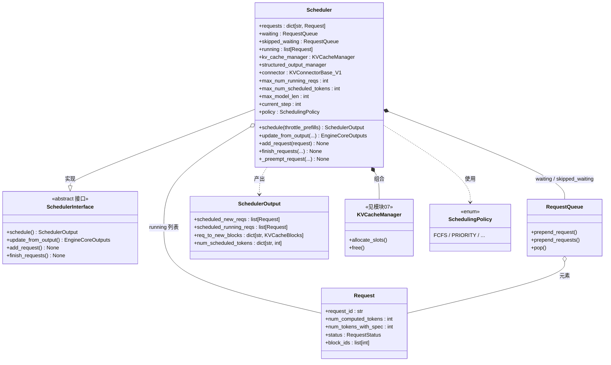

# 04 · Scheduler（调度器）类图

> 源码：`vllm/v1/core/sched/scheduler.py`
> 角色：**每步选出哪些请求、给它们分配多少 token 和 KV block**，产出 `SchedulerOutput` 交给执行器。

## 关键点

1. **没有 prefill/decode 两个阶段**（这是 V1 的重要设计）：每个请求只有
   `num_computed_tokens`（已算到哪）和 `num_tokens_with_spec`（要算到哪），
   每步调度就是"让 computed 追赶 with_spec"，统一覆盖 chunked prefill、prefix cache、投机解码。
2. **两个等待队列**：
   - `waiting`：真正的就绪队列，新请求进来先待在这；
   - `skipped_waiting`：本轮因依赖/约束（如 `WAITING_FOR_REMOTE_KVS`）暂时无法调度、
     被跳过的请求，避免每步反复检查。
3. **约束**：`max_num_running_reqs`（并发请求数上限）和 `max_num_scheduled_tokens`（每步 token 预算），
   是 while 循环的退出条件。
4. **`connector`**：P/D 分离（disaggregated prefill）场景的 KV 跨引擎传输通道，单卡为 `None`。
