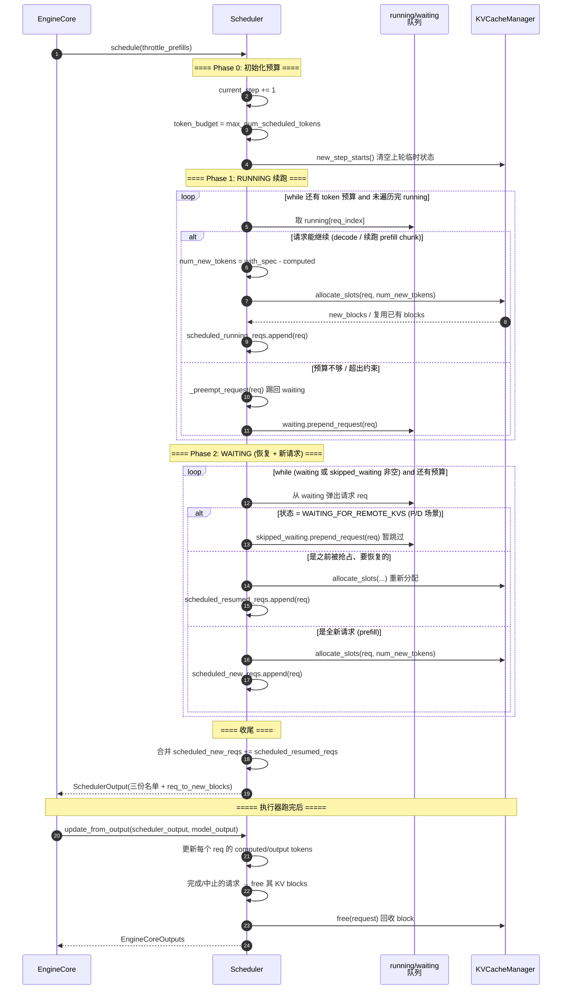

# 04 · Scheduler 时序图

> **一次 `schedule()` 的三阶段**：RUNNING（续跑）→ WAITING（恢复被抢占 + 新请求 prefill）→
> 分配 KV block → 产出 `SchedulerOutput`。最后 `update_from_output()` 收尾。

## 关键点

1. **三份名单**：`scheduled_running_reqs`（续跑）、`scheduled_resumed_reqs`（被抢占恢复）、
   `scheduled_new_reqs`（新 prefill），一起写进 `SchedulerOutput` 交给执行器。
2. **KV 分配在调度时就完成**：`schedule()` 里直接调 `kv_cache_manager.allocate_slots()`，
   所以 `SchedulerOutput` 里已经带上了 `req_to_new_blocks`（每个请求新分配的 block）。
3. **抢占（preempt）**：token 预算不够时，把 running 里的请求踢回 waiting，等下一轮恢复。
4. **`WAITING_FOR_REMOTE_KVS`**：P/D 分离时，等远端 KV 传输的请求本轮跳过，不浪费预算。
