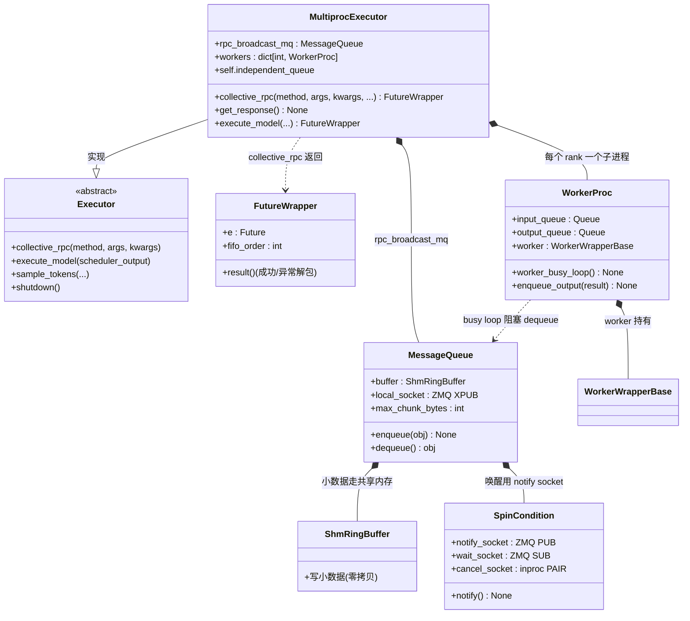

# 05 · MultiprocExecutor（执行器）类图

> 源码：`vllm/v1/executor/abstract.py`、`multiproc_executor.py`、`distributed/device_communicators/shm_broadcast.py`
> 角色：**引擎后端进程内，把调度结果通过 IPC 发给各个 Worker 子进程，再收回结果**。

## 关键点

1. **`MultiprocExecutor` 是父进程侧的调度代理**：`collective_rpc(method, ...)` 只做一件事——
   把 `(method, args, kwargs, output_rank)` 四元组 `enqueue` 进广播队列，立刻返回 `FutureWrapper`。
2. **`WorkerProc` 是子进程的"驱动外壳"**：它包住真正的 `WorkerWrapperBase`，跑
   `worker_busy_loop()` 阻塞等队列，收到就 `getattr(self.worker, method)` 查表执行。
3. **`MessageQueue` 内部双通道**（对应之前学过的内容）：
   - 小数据 → `ShmRingBuffer`（共享内存环形缓冲区，零拷贝）；
   - 大数据（≥ `max_chunk_bytes`）→ `local_socket`（ZMQ XPUB 溢出通道）；
   - 唤醒 → `SpinCondition`（普通 PUB/SUB，1 字节 ping）。
4. **`FutureWrapper.result()`** 才是真正的"拉结果"：内部解包 `(SUCCESS/FAILURE, result)`，
   支持多轮 `collective_rpc` 的 FIFO 顺序返回。
