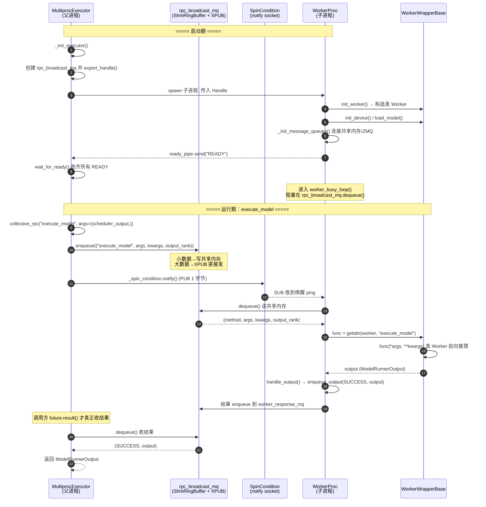

# 05 · MultiprocExecutor 时序图

> 上半张：**启动期**（spawn 子进程 → 就绪 → 进入 busy loop）。
> 下半张：**运行期**（`execute_model` 一次完整往返）。

## 关键点

1. **发出去 ≠ 等回来**：`collective_rpc` 只 `enqueue` 然后立刻返回 `FutureWrapper`，不阻塞。
2. **数据与信号分离**：数据走 `rpc_broadcast_mq`（共享内存 / XPUB），唤醒走 `SpinCondition`
   的 notify socket（1 字节 ping）。
3. **查表执行**：Worker 侧没有 if/elif 分发表，就是 `getattr(self.worker, method)(*args, **kwargs)`。
4. **结果靠"拉"**：结果不是 Worker "推"回来的，而是 Executor 侧 `future.result()` 主动
   `dequeue()` 拉回来；`FutureWrapper` 的 FIFO drain 保证多并发 RPC 按发出顺序返回。
