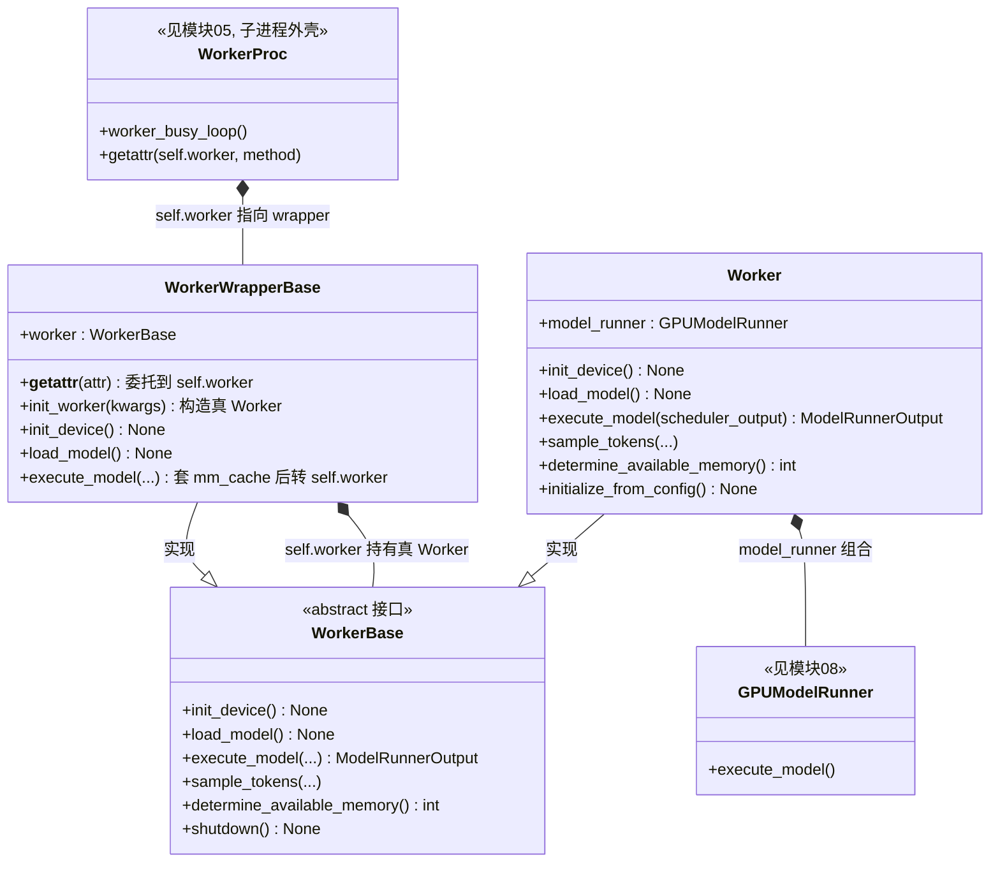

# 06 · Worker（启动与工作）类图

> 源码：`vllm/v1/worker/worker_base.py`、`vllm/v1/worker/gpu_worker.py`
> 角色：**每个 GPU 子进程里真正干活的执行单元**。`WorkerWrapperBase` 是"壳"，
> `Worker` 是"芯"，两者靠 `__getattr__` 委托衔接。

## 关键点

1. **两层壳**：
   - `WorkerProc`（模块 05）里的 `self.worker` 其实是 `WorkerWrapperBase`；
   - `WorkerWrapperBase` 里的 `self.worker` 才是真正的 `Worker`（gpu_worker.py）。
2. **`__getattr__` 委托**（`worker_base.py:333`）：`WorkerWrapperBase` 本身不实现所有方法，
   遇到不认识的方法就 `return getattr(self.worker, attr)`，所以
   `getattr(wrapper, "execute_model")` 能一路查到真 Worker。
3. **`execute_model` 特殊处理**（`worker_base.py:346`）：wrapper 的 `execute_model` 先套一层
   多模态缓存（`_apply_mm_cache`），再调 `self.worker.execute_model`——这是壳能"增强"芯的地方。
4. **启动链路**：`init_worker`（构造 Worker）→ `init_device`（分配 GPU）→ `load_model`（加载权重），
   都在子进程里按顺序执行。
