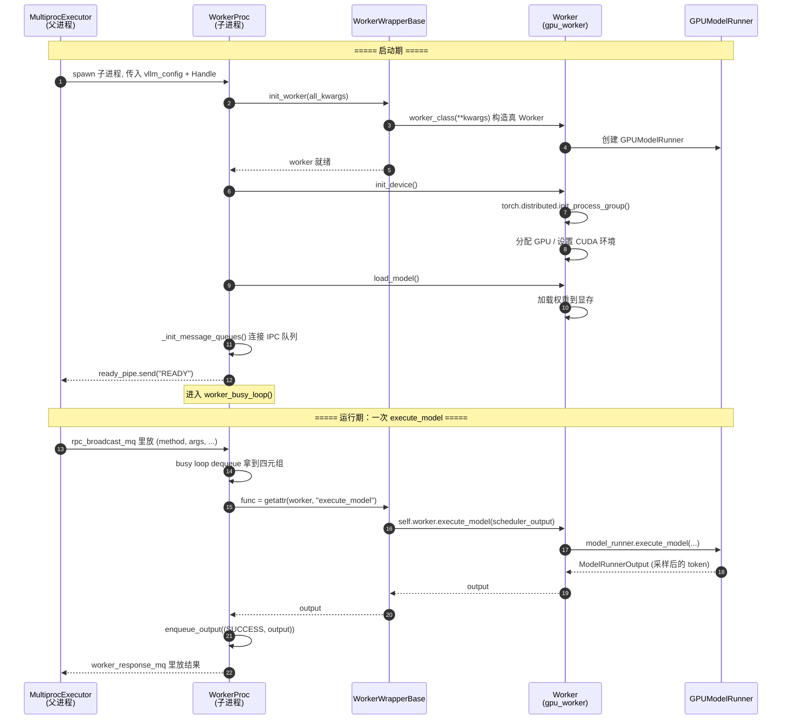

# 06 · Worker 时序图

> Worker 子进程的**生命周期**：初始化 → 进 busy loop → 收到 RPC 查表执行。

## 关键点

1. **`init_worker` 负责"造芯"**：`worker_base.py:319` 的 `self.worker = worker_class(**kwargs)`
   这一步才真正实例化 `Worker`。
2. **`init_device` / `load_model` 各自职责**：前者建分布式进程组 + 分卡；后者加载权重。
   分开是为了支持权重更新（热加载）时不必重新初始化设备。
3. **busy loop 里"查表执行"**：`getattr(self.worker, method)` 里 `self.worker` 是 wrapper，
   靠 `__getattr__` 委托到真 Worker，所以方法名对得上就能被远程调用。
