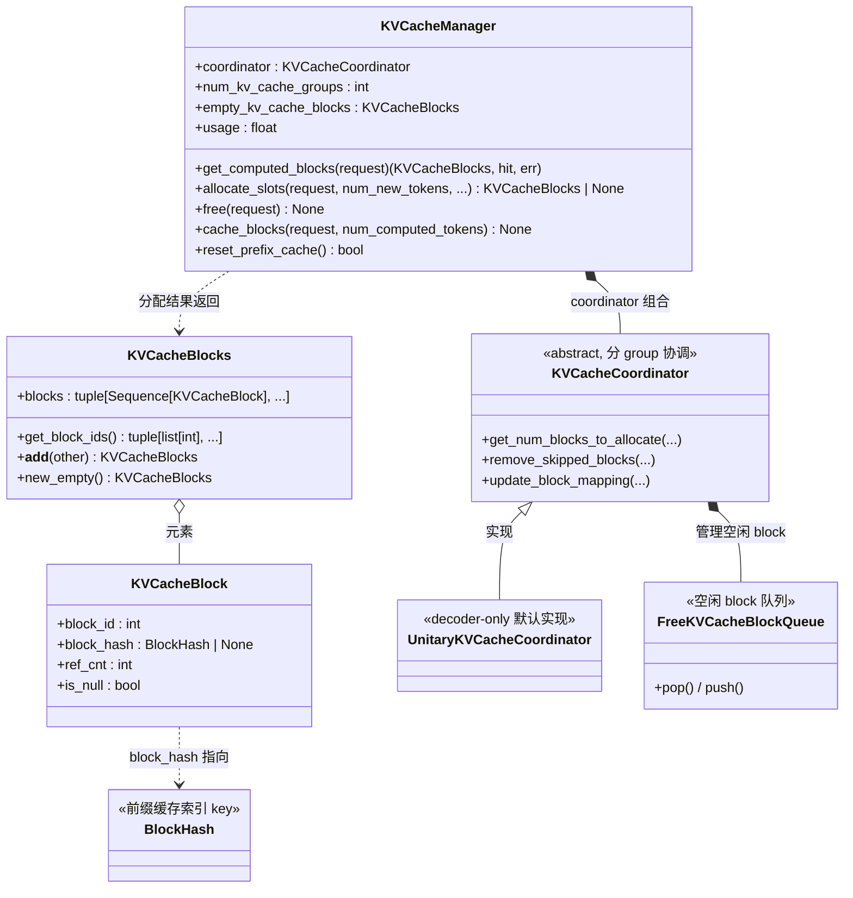

# 07 · KVCacheManager（KV Cache 管理）类图

> 源码：`vllm/v1/core/kv_cache_manager.py`、`kv_cache_coordinator.py`、`kv_cache_utils.py`
> 角色：**物理 block 池 + 前缀缓存 + 引用计数**的统一账本。Scheduler 不直接摸 block，
> 只通过三个 API 交互：`get_computed_blocks()` / `allocate_slots()` / `free()`。

## 关键点

1. **`KVCacheBlocks` 是 Scheduler 与 KVCacheManager 之间的"接口隔离层"**：
   它把物理 block 包起来，Scheduler 只看到 `get_block_ids()`，看不到内部结构。
2. **`coordinator` 是真正的分配器**：`KVCacheManager.allocate_slots()` 里其实是调
   `coordinator.get_num_blocks_to_allocate()` / `remove_skipped_blocks()` 干活。
   - decoder-only 模型走 `UnitaryKVCacheCoordinator`（单 group）；
   - 混合架构（encoder-decoder、mamba）走别的 coordinator 子类。
3. **引用计数**：每个 `KVCacheBlock` 有 `ref_cnt`，多个请求共享同一前缀 block 时 +1，
   释放时 -1，归零才真正回收到 `FreeKVCacheBlockQueue`。
4. **前缀缓存**：`block_hash` 是 block 内容的 hash，`get_computed_blocks()` 用它做
   key 匹配，命中即复用（不重新算），未命中才走 `allocate_slots()` 分配新 block。
