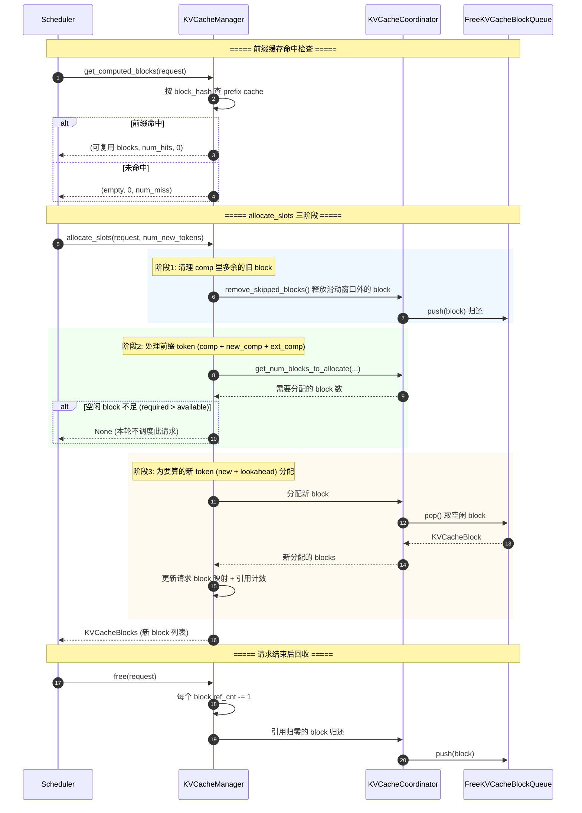

# 07 · KVCacheManager 时序图

> 一次 `allocate_slots()` 的三阶段分配，以及请求结束后的 `free()` 回收。

## 关键点

1. **前缀缓存先查后分**：`get_computed_blocks()` 先看有没有现成 block 能复用；
   `allocate_slots()` 只给真正需要新算的 token 分配 block。
2. **三阶段分配**（源码 `kv_cache_manager.py:486` 注释原文）：
   - 阶段1：释放 comp 里多余的 block，并检查空闲 block 是否够（不够直接返回 None）；
   - 阶段2：处理前缀 token（含滑动窗口外释放、connector 外部 token 的 block）；
   - 阶段3：为 `new + lookahead`（含投机解码前瞻）分配新 block。
3. **分配失败 = 不调度**：`allocate_slots` 返回 `None` 时，Scheduler 会把该请求
   放回 waiting（或抢占 running 里的请求），而不是硬塞。
4. **引用计数回收**：`free()` 只做 ref_cnt -1，归零才真正回收到空闲队列，
   这样共享前缀的多个请求不会互相影响。
