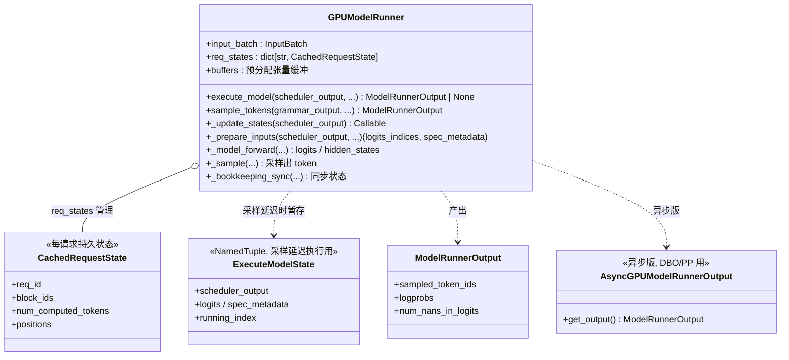

# 08 · GPUModelRunner（Worker 内部）类图

> 源码：`vllm/v1/worker/gpu_model_runner.py`
> 角色：**真正把 SchedulerOutput 变成 GPU 计算 + 采样**的地方，是 Worker 的"心脏"。

## 关键点

1. **`execute_model` 是一套固定流水线**：
   `_update_states()`（更新 batch 状态）→ `_prepare_inputs()`（拼输入张量）→
   `_model_forward()`（torch 前向）→ `_sample()`（采样）。
2. **采样可"延迟"**：当需要结构化输出/语法约束（grammar bitmask）时，`execute_model`
   只算 logits，把中间状态存进 `self.execute_model_state` 后返回 `None`；
   由上层（EngineCore）拿到 grammar bitmask 后再调 `sample_tokens()` 完成采样。
   - 对应 `core.py:679-681`：`model_output is None` 时再调 `sample_tokens(grammar_output)`。
3. **`CachedRequestState` 是增量状态**：每个请求的 block_ids、已算 token 数、位置等
   持久保存，避免每步重复计算，只增量更新。
4. **buffers 预分配**：input_ids、positions、slot_mappings 等张量一次性 `_make_buffer`
   分好，每步原地写，避免反复 `torch.empty` 的开销。
