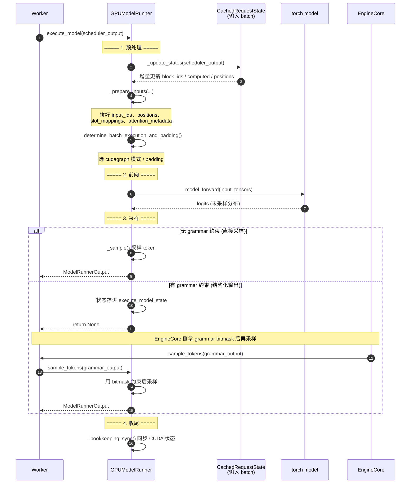

# 08 · GPUModelRunner 时序图

> **一次 `execute_model()` 的完整内部流水线**，以及"采样延迟"（grammar 约束）的变体。

## 关键点

1. **四段流水线**：预处理 → 前向 → 采样 → 收尾。前向只产出 **logits（未采样分布）**，
   采样是独立一步。
2. **采样延迟的核心动机**：结构化输出（JSON schema / grammar）需要在采样前把
   grammar bitmask 传进来，而 bitmask 由 Scheduler 侧算好（`get_grammar_bitmask`），
   所以 `execute_model` 先算完 logits 就返回 None，等 bitmask 到位再 `sample_tokens`。
3. **增量状态**：`_update_states` 只更新本轮新增的部分，旧 block 的状态直接复用，
   这是 V1 相比 V0 每步全量重建输入的性能关键。
4. **cudagraph 选择**：`_determine_batch_execution_and_padding` 根据 batch 形状决定
   是否走 CUDA Graph 路径，避免动态 shape 的 kernel 启动开销。
