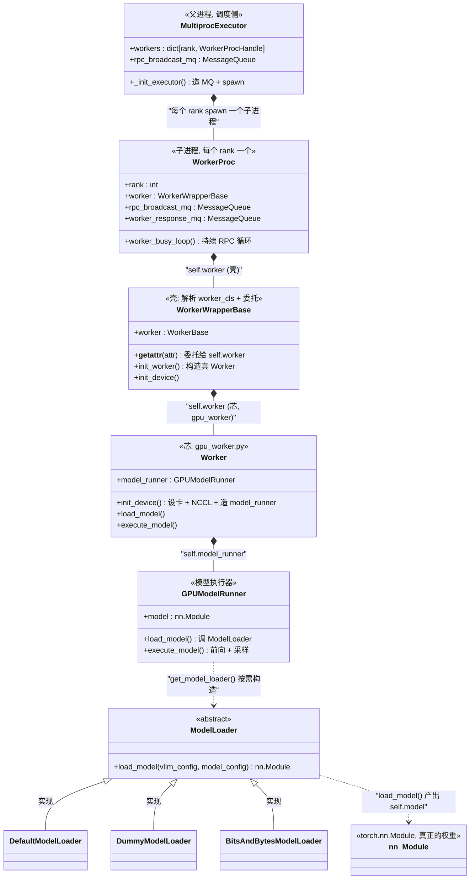

# 09 · MultiprocExecutor → WorkerProc → Worker → ModelRunner → ModelLoader 包含图

> 这条链是**逐层"套娃"的组合（has-a）关系**：外层负责进程/IPC/调度，内层才真正碰模型。
> 源码：`multiproc_executor.py`、`worker_base.py`、`gpu_worker.py`、`gpu_model_runner.py`、`model_executor/model_loader/`

## 逐层职责一句话

| 层 | 对象 | 干什么 | 关键源码 |
|----|------|--------|----------|
| 1 | `MultiprocExecutor` | 父进程：建 MQ、spawn、发 RPC | `multiproc_executor.py:167` `_init_executor` |
| 2 | `WorkerProc` | 子进程外壳：初始化 + busy loop | `multiproc_executor.py:760` |
| 3 | `WorkerWrapperBase` | 解析 `worker_cls`、`__getattr__` 委托 | `worker_base.py:187` |
| 4 | `Worker` | 设卡、NCCL、造 model_runner、加载权重 | `gpu_worker.py:128` |
| 5 | `GPUModelRunner` | 前向 + 采样 | `gpu_model_runner.py:463` |
| 6 | `ModelLoader` | 按 `load_format` 选加载器拉权重 | `model_loader/__init__.py` |

## 关键点

1. **两层 `self.worker`**：`WorkerProc.worker` 是 `WorkerWrapperBase`（壳），
   `WorkerWrapperBase.worker` 才是真 `Worker`。中间靠 `__getattr__`（`worker_base.py:333`）无缝透传。
2. **`model_runner` 在 `init_device` 里构造**（`gpu_worker.py:472`），不是 `__init__` 里；
   因为要先确定 `self.device`（哪张卡）才能建 runner。
3. **`model` 在 `load_model` 里才出现**：`GPUModelRunner.load_model`（`gpu_model_runner.py:5322`）
   里 `get_model_loader(load_config)` 选加载器，再 `load_model()` 产出 `self.model`。
4. **`ModelLoader` 是策略模式**：`DefaultModelLoader`（正常加载）、`DummyModelLoader`（占位测试）、
   `BitsAndBytesModelLoader`（量化）……由 `load_config.load_format` 决定用哪个。
