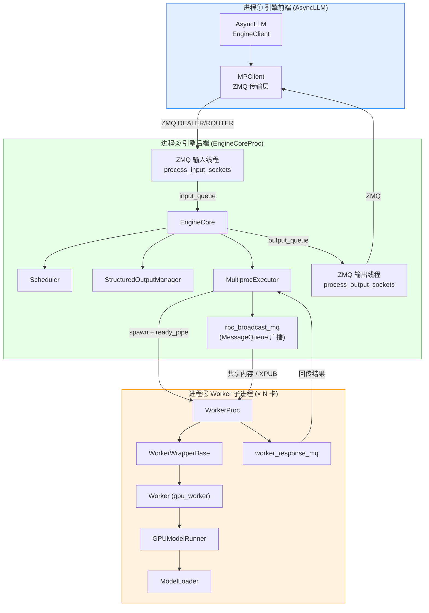

# 09 · 三个进程 + 对象归属总览图

> 用 `flowchart` 的 `subgraph` 表示**三个 OS 进程**（不同背景色），
> 每个 subgraph 内列该进程持有的对象，箭头表示**跨进程连接**。

## 三个进程一句话

| 进程 | 颜色 | 职责 | 与谁通信 |
|------|------|------|----------|
| ① 引擎前端 | 蓝 | 收 HTTP、预处理输入、回传 token | 进程②（ZMQ） |
| ② 引擎后端 | 绿 | 调度 + 执行 + KV cache 账本 | 进程①（ZMQ）、进程③（共享内存 + pipe） |
| ③ Worker | 橙 | GPU 前向 + 采样 | 进程②（共享内存 + pipe） |

## 跨进程连接三种介质

1. **前端 ↔ 后端**：ZMQ `DEALER/ROUTER`（输入线程 + 输出线程收发包）。
2. **后端 ↔ Worker（下行业务数据）**：`rpc_broadcast_mq` —— 共享内存环形缓冲区，大数据溢出到 XPUB。
3. **后端 ↔ Worker（握手/存活/回传）**：`ready_pipe`（就绪）、`death_pipe`（父死检测）、`worker_response_mq`（结果回传）。
