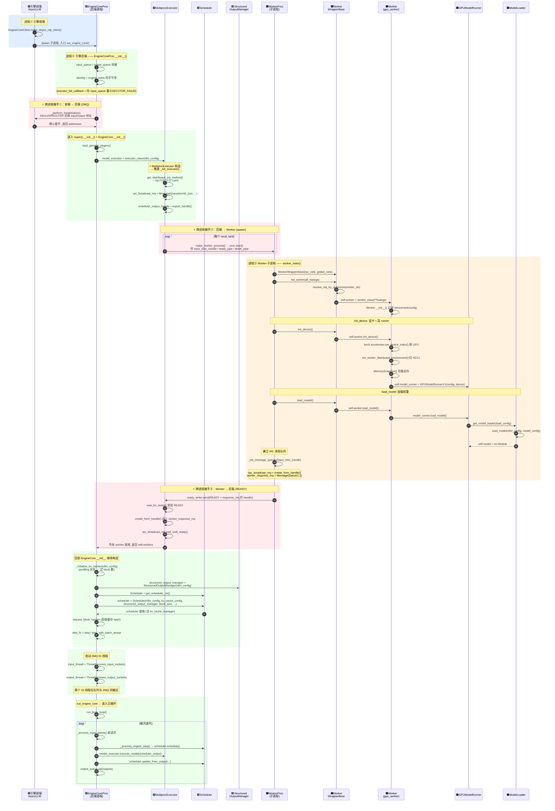

# 09 · 从 EngineCore 构造到 run_busy_loop 的完整启动时序图

> 三种颜色背景 = 三个 OS 进程：
> 🟦 蓝 = 引擎前端 · 🟩 绿 = 引擎后端 · 🟧 橙 = Worker 子进程 · 🟥 红 = 跨进程握手/连接。

## 关键顺序（源码核对）

1. **握手在构造 model_executor 之前**：`EngineCoreProc.__init__`（[core.py:1193](vllm/v1/engine/core.py#L1193)）
   先 `_perform_handshakes()` 跟前端完成 ZMQ 握手，之后才 `super().__init__()`（[core.py:1223](vllm/v1/engine/core.py#L1223)）。

2. **Worker 全就绪后 Scheduler 才出生**：`EngineCore.__init__` 里顺序是
   `model_executor = executor_class(...)`（**这一步 spawn 完所有 worker 并等 READY**）→
   `_initialize_kv_caches` → `StructuredOutputManager` → `Scheduler`。
   所以 `Scheduler` 构造时，worker 已经在 busy loop 里等任务了。

3. **三处握手介质不同**：
   - 前端↔后端：ZMQ DEALER/ROUTER；
   - 后端→Worker 下行：`rpc_broadcast_mq`（共享内存）+ `ready_pipe`；
   - Worker→后端回传：`worker_response_mq`。

4. **`ready_pipe` 就绪信号里带的是 `worker_response_mq` 的 handle**（[multiproc_executor.py:1162](vllm/v1/executor/multiproc_executor.py#L1162)）：
   后端拿到这个 handle 才能 `create_from_handle()` 连上回传通道——这就是"就绪"和"连接"绑在一起的原因。

5. **IO 线程最后才启动**（[core.py:1250](vllm/v1/engine/core.py#L1250)）：input/output 两个线程在
   引擎核心对象全部构造完后才起，避免构造期间就收到请求。
