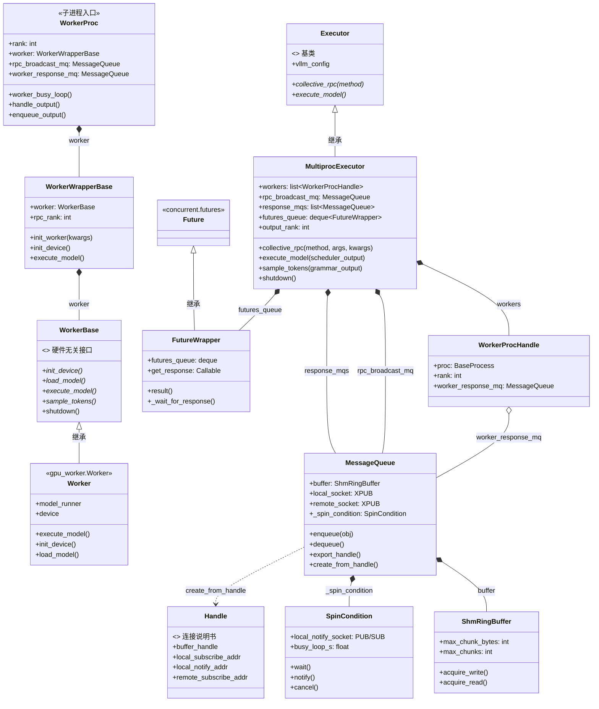

# MultiprocExecutor — Worker 类关系图（UML Class Diagram）

> 在 VSCode 安装 `Markdown Preview Mermaid Support` 插件后即可预览。
> 箭头含义：`<|--` 继承 · `*--` 组合(强拥有) · `o--` 聚合(弱拥有) · `..>` 依赖。

## 关键点说明

1. **两层 "worker" 别搞混**：
   - `WorkerProc.worker` 是 `WorkerWrapperBase`（包装器）
   - `WorkerWrapperBase.worker` 才是真正的 `Worker`（`gpu_worker.Worker`，继承 `WorkerBase`）
   - 因此 `worker_busy_loop` 里 `getattr(self.worker, method)` 拿到的是**包装器**的方法：
     包装器自己定义了 `execute_model`（会先 `_apply_mm_cache` 再调真 Worker）；
     没定义的方法则靠 `WorkerWrapperBase.__getattr__` 转发给内层真 Worker（见
     [worker_base.py:333](vllm/vllm/v1/worker/worker_base.py#L333)）。

2. **进程边界**：`MultiprocExecutor`（父进程）与 `WorkerProc`（子进程）之间没有直接引用，
   唯一的"桥"是 `Handle` + `MessageQueue`（共享内存 + XPUB + notify socket）。
   `WorkerProcHandle` 是父进程手里的一张"名片"，只记录子进程的 `proc` 和它的回传队列。

3. **`FutureWrapper` 继承标准库 `Future`**：让 `execute_model` 在 `non_block=True` 时
   立即返回一个 Future，`result()` 时才按 FIFO 顺序真正去 `response_mqs` 收结果。
