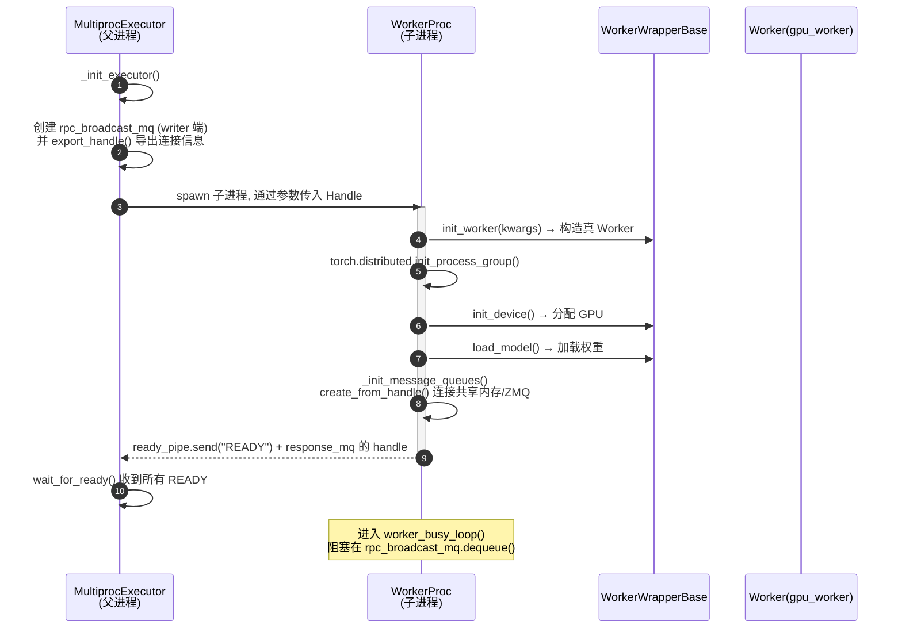
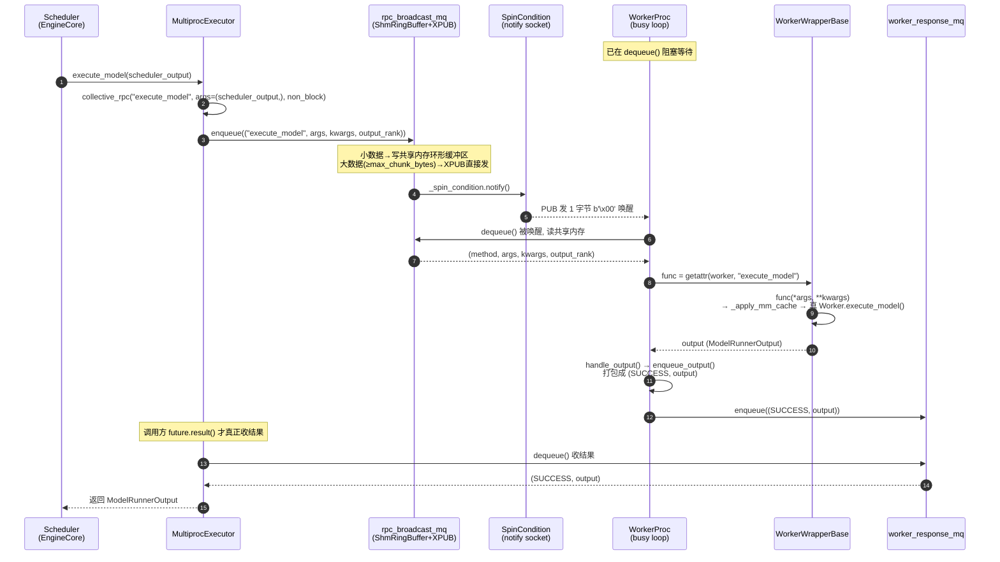

# MultiprocExecutor — Worker 时序图（UML Sequence Diagram）

> 在 VSCode 安装 `Markdown Preview Mermaid Support` 插件后即可预览。
> `->>` 同步调用(带返回) · `-->>` 异步消息 · `Note` 注释。

## 一、启动时序（spawn → 就绪 → busy loop）

## 二、RPC 运行时序（execute_model 一次完整往返）

## 关键点说明

1. **发送侧（第 4-5 步）**：`collective_rpc` 只做一件事——把 `(method, args, kwargs, output_rank)`
   这个四元组 `enqueue` 进广播队列，**立刻返回一个 `FutureWrapper`**，不阻塞等结果。
   这正是异步 RPC 的核心：发出去 ≠ 等回来。

2. **数据与信号的分离**：
   - 数据走 `rpc_broadcast_mq`（共享内存，或大数据溢出到 XPUB）
   - 唤醒走 `SpinCondition` 的 notify socket（普通 PUB/SUB，1 字节 ping）

3. **查表执行（第 8-9 步）**：Worker 侧没有 if/elif 分发表，就一行
   `getattr(self.worker, method)(*args, **kwargs)`，方法名对得上就能被远程调用。

4. **收结果（第 12-14 步）**：结果不是 Worker "推"回来的，而是 Executor 侧
   `future.result()` 主动去 `worker_response_mq` 里 `dequeue()` 拉回来的；
   `FutureWrapper` 用 FIFO drain 保证多个并发 RPC 的结果按发出顺序返回。
